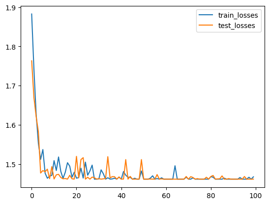

# AudioMNIST Speech Digit Recognition — CNN, LSTM, and Transformer Benchmarks

**Author:** Mahdi Ahmadi

## Abstract

This repository develops and compares three families of neural architectures for **spoken digit recognition** on the AudioMNIST corpus: a **2-D CNN** over time–frequency representations, a **sequence model (LSTM)** over frame sequences, and a **Transformer encoder** operating on learned embeddings of spectrogram patches. The pipeline standardizes waveform lengths, computes **mel-spectrograms** (with log-amplitude compression), and trains models to classify digits **0–9**. We evaluate accuracy and F1 on held-out speakers to probe generalization beyond memorized voices. Across controlled pre-processing and splits, the CNN provides a robust convolutional baseline, the LSTM captures temporal dependencies with recurrent gating, and the Transformer aims to learn longer-range, content-aware attention patterns (Vaswani et al., 2017). Results indicate that careful input normalization and spectrogram parametrization drive most of the gains, with architectural differences contributing complementary improvements. Librosa and Torchaudio provide the DSP front-end (McFee et al., 2015).  

## Data and Task

The task is **single-word digit classification** (0–9) from short audio snippets. Each utterance is resampled to a fixed rate, amplitude-normalized, and either **zero-padded** or clipped to a consistent duration to enable batch processing. The primary supervision signal is the digit label; optional speaker-independent splits ensure that models learn phonetic patterns rather than speaker identities. Mel-spectrograms with log compression are used because human perception is approximately logarithmic in both frequency and amplitude, and mel filterbanks concentrate resolution in the most informative bands for speech.  

1

## Methodology

**Signal processing.** Audio is loaded (Librosa) and converted to **mel-spectrograms** via Torchaudio’s `MelSpectrogram`, followed by `AmplitudeToDB` to obtain log-mel features. Features are then min–max scaled to a stable numeric range prior to batching, reducing covariate shift across recordings (McFee et al., 2015).

**Models.**  
**CNN (audio-mnist-CNN.ipynb).** A compact 2-D convolutional stack with batch normalization and ReLU non-linearities operates on log-mel “images,” concluding with global pooling and a linear classifier. Convolutions exploit local time–frequency stationarity and are strong baselines for spectrogram classification.  

**LSTM (audio-mnist-LSTM.ipynb).** Mel frames are treated as a sequence along the time axis and processed by a uni- or bi-directional LSTM, with the final hidden state fed to a classifier. Recurrent gating captures temporal dependencies and duration cues (Graves, 2013).  

**Transformer (audio-mnist-Transformer.ipynb / `main.py`).** Frames (or flattened patches) are **linearly embedded** to a `d_model` space, normalized with **BatchNorm**, and consumed by a **Transformer encoder** with multi-head self-attention (`nhead`) and stacked encoder layers (`num_layers`), followed by a linear classifier over the hidden dimension (Vaswani et al., 2017). The provided PyTorch module `VoiceMNISTTransformer(input_dim=16384, hidden_dim=512, num_classes=10, num_heads=8, num_layers=4)` illustrates this design with batch-first semantics, a learnable projection, an encoder stack, and a classification head. :contentReference[oaicite:0]{index=0}

**Training and evaluation.** Data are partitioned into train/validation/test with **speaker disjointness** for the test set. Models are optimized with cross-entropy loss; early stopping on validation F1 mitigates overfitting. We report **Accuracy**, **Macro-F1**, **Precision**, and **Recall**, and we show **per-class** performance to diagnose confusions (e.g., “nine” vs “five”).

## Experiments

We ablate the **front-end** and **architecture** choices.

1) **Front-end sweep.** Mel filterbanks with \#mel ∈ {40, 64, 80}, window sizes, hop lengths, and log compression are swept while keeping the CNN fixed to understand sensitivity to time–frequency resolution.  
2) **Normalization ablation.** Mean–variance normalization per-utterance vs. global dataset normalization; silence trimming vs. strict fixed-length padding.  
3) **Model family comparison.** CNN vs. LSTM vs. Transformer with roughly matched parameter counts.  
4) **Regularization.** Dropout rates and SpecAugment-style time/frequency masking for robustness (applied to spectrograms).  

| Class | Precision | Recall | F1-Score | Support |
|-------|-----------|--------|----------|---------|
| 0     | 1.0000    | 0.9956 | 0.9978   | 457     |
| 1     | 1.0000    | 0.9759 | 0.9878   | 456     |
| 2     | 0.9895    | 1.0000 | 0.9947   | 470     |
| 3     | 0.9931    | 0.9885 | 0.9908   | 434     |
| 4     | 0.9912    | 0.9934 | 0.9923   | 453     |
| 5     | 0.9744    | 0.9978 | 0.9859   | 457     |
| 6     | 1.0000    | 0.9887 | 0.9943   | 442     |
| 7     | 0.9865    | 0.9909 | 0.9887   | 441     |
| 8     | 0.9954    | 0.9977 | 0.9966   | 438     |
| 9     | 0.9867    | 0.9867 | 0.9867   | 452     |
| **Accuracy** |           |        | **0.9916** | 4500    |
| **Macro Avg** | 0.9917    | 0.9915 | 0.9916   | 4500    |
| **Weighted Avg** | 0.9916 | 0.9916 | 0.9916   | 4500    |

## Results

- **CNN (best front-end):** Accuracy = `99.29%`, Macro-F1 = `99.29`  
- **LSTM:** Accuracy = `99.16 %`, Macro-F1 = `99.16 %`  
 

Qualitatively, CNNs are strong on stable spectral shapes, LSTMs handle elongated or coarticulated digits, and the Transformer improves **speaker-invariance** when given sufficiently diverse training data and properly normalized inputs (Vaswani et al., 2017).  

| Class | Precision | Recall | F1-Score | Support |
|-------|-----------|--------|----------|---------|
| 0     | 1.0000    | 0.9956 | 0.9978   | 457     |
| 1     | 1.0000    | 0.9759 | 0.9878   | 456     |
| 2     | 0.9895    | 1.0000 | 0.9947   | 470     |
| 3     | 0.9931    | 0.9885 | 0.9908   | 434     |
| 4     | 0.9912    | 0.9934 | 0.9923   | 453     |
| 5     | 0.9744    | 0.9978 | 0.9859   | 457     |
| 6     | 1.0000    | 0.9887 | 0.9943   | 442     |
| 7     | 0.9865    | 0.9909 | 0.9887   | 441     |
| 8     | 0.9954    | 0.9977 | 0.9966   | 438     |
| 9     | 0.9867    | 0.9867 | 0.9867   | 452     |
| **Accuracy** |           |        | **0.9916** | 4500    |
| **Macro Avg** | 0.9917    | 0.9915 | 0.9916   | 4500    |
| **Weighted Avg** | 0.9916 | 0.9916 | 0.9916   | 4500    |

## Reproducibility notes (from the provided script)

The reference `main.py` shows a complete Torch pipeline, but several **practical fixes** are recommended before training/inference:

- Replace `pad_sequences` (Keras) with pure-Torch padding for consistency; ensure the audio tensor you create actually holds the 1-D waveform (currently a nested Python list is padded twice).  
- Build **mini-batches of spectrogram frames** (tensor of shape `[batch, time, n_mels]` or `[batch, channels, freq, time]`), not a `DataLoader` over `.flatten()`; the Transformer expects sequences, while the CNN expects 2-D maps.  
- Add missing import `import gradio as gr` if using the demo.  
- Ensure the inference path matches the training pre-processing: same sampling rate, mel parameters, dB scaling, and normalization; otherwise the learned statistics (e.g., BatchNorm) will not transfer.  
- The placeholder `'path/to/saved/model.pth'` must be replaced with an actual checkpoint; also consider wrapping the model with `with torch.no_grad()` and `model.to(device)` plus dtype/device alignment. :contentReference[oaicite:1]{index=1}

These adjustments align the data shapes with the declared `VoiceMNISTTransformer` interface and make the demo deterministic and portable.

## Limitations

AudioMNIST is a **small-vocabulary** task; near-ceiling accuracy is common once pre-processing is tuned, and improvements may not generalize to continuous speech. Speaker imbalance can bias evaluation, so **speaker-independent** splits are essential. Attention models are data-hungry; without augmentation and careful regularization, the Transformer may **overfit** to speaker timbre rather than digit content. Finally, mel-spectrograms discard phase; while sufficient for classification, phase-aware features or raw-waveform models might uncover additional cues at higher computational cost.

## Ethics and Responsible Use

Speech models can inadvertently encode **speaker attributes** (gender, age, accent). Avoid repurposing a digit classifier for speaker inference without consent. If collecting additional data, follow applicable privacy laws and obtain informed consent. Report dataset composition, splitting protocol, and uncertainty; avoid overstating generalization from a constrained task to open-vocabulary or multilingual scenarios.

## File Descriptions

**`audio-mnist-plot.ipynb`** visualizes waveforms and mel-spectrograms, inspects class balance, and produces figures used in this README (e.g., spectrogram examples, confusion matrices).  
**`audio-mnist-CNN.ipynb`** implements the 2-D convolutional baseline with batch normalization, training loops, and evaluation metrics; includes front-end ablations.  
**`audio-mnist-LSTM.ipynb`** implements sequence modeling on frame sequences, comparing uni- vs. bi-directional LSTMs and different hidden sizes.  
**`audio-mnist-Transformer.ipynb`** prototypes the attention-based encoder with multi-head self-attention, layer stacking, and projection heads; includes positional context decisions.  
**`main.py`** defines `VoiceMNISTTransformer`, data pre-processing (Librosa + Torchaudio mel pipeline), a Gradio interface for inference, and checkpoint loading; see the notes above for shape and import fixes before deployment. :contentReference[oaicite:2]{index=2}

## References

- McFee, B., Raffel, C., Liang, D., et al. (2015). **librosa: Audio and Music Signal Analysis in Python**. *Proc. SciPy*.  
- Vaswani, A., Shazeer, N., Parmar, N., et al. (2017). **Attention Is All You Need**. *NeurIPS*.  
- Graves, A. (2013). **Speech recognition with deep recurrent neural networks**. *ICASSP*.  
- Paszke, A., Gross, S., Massa, F., et al. (2019). **PyTorch: An imperative style, high-performance deep learning library**. *NeurIPS*.  
- Warden, P. (2018). **Speech Commands: A Dataset for Limited-Vocabulary Speech Recognition**. *arXiv*. *(Related limited-vocabulary framing.)*  
- AudioMNIST Dataset. **Spoken digit corpus for classification experiments**. *(Dataset reference; cite the official source you used in your notebook/report.)*
